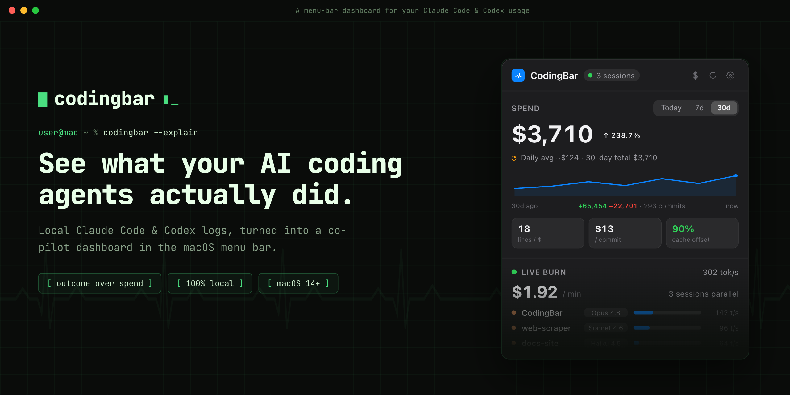
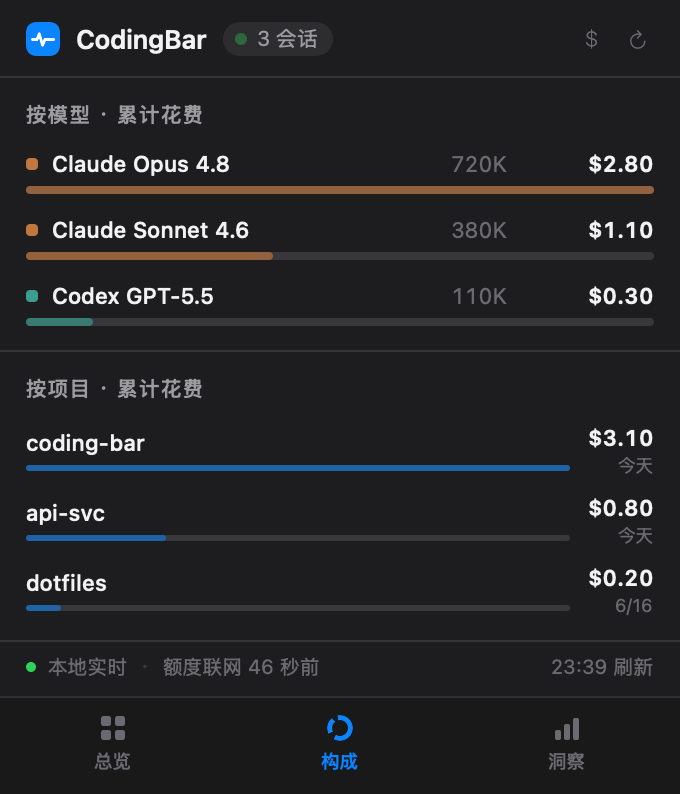
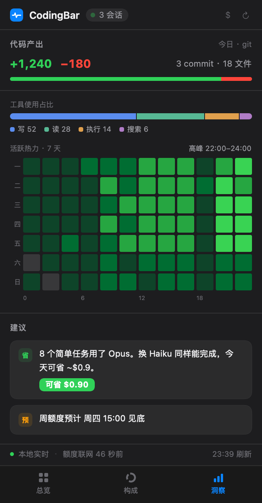
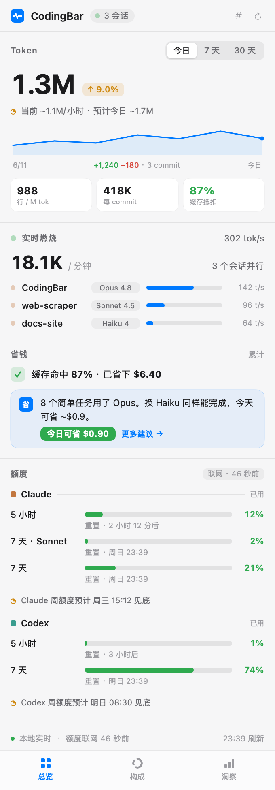
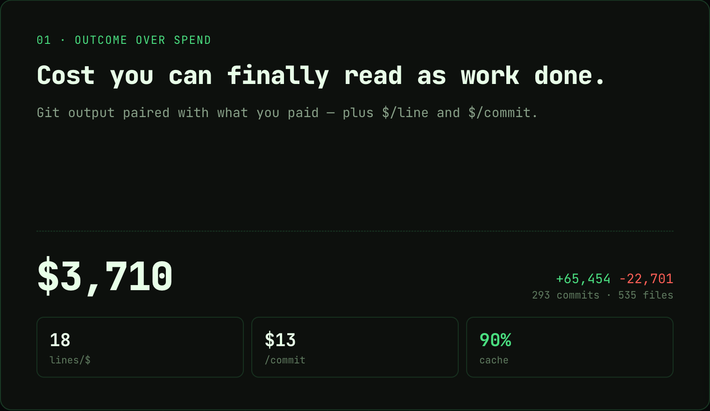
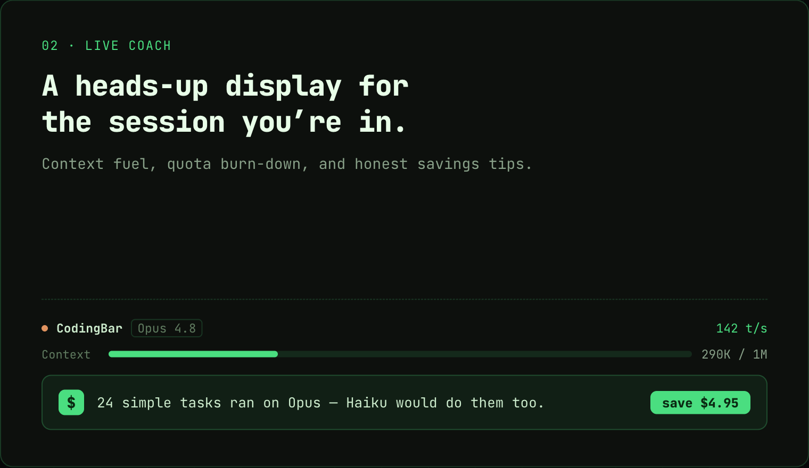
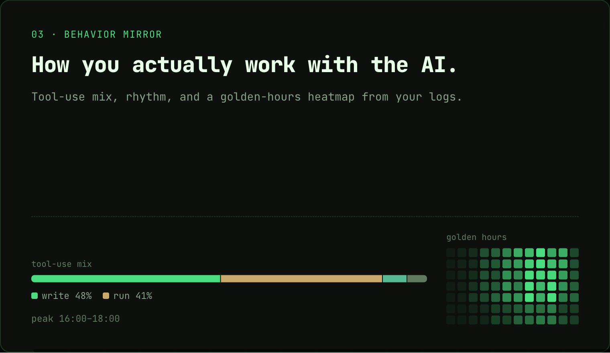
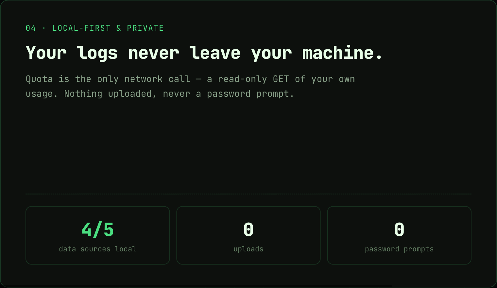

<h4 align="right"><strong>English</strong> | <a href="README_ZH.md">简体中文</a></h4>

<div align="center">
  <h1>CodingBar</h1>
  <p><b>See what your AI coding agents actually did — from the macOS menu bar.</b></p>
  <a href="https://github.com/Gnonymous/CodingBar/actions/workflows/ci.yml"></a>
  <a href="https://github.com/Gnonymous/CodingBar/stargazers"></a>
  <a href="https://github.com/Gnonymous/CodingBar/releases"></a>
  <a href="LICENSE"></a>
  
  
</div>

<p align="center">
  
</p>

<details>
<summary><strong>More views — Composition · Insights · Light mode</strong></summary>
<br/>
<table>
  <tr>
    <td></td>
    <td></td>
    <td></td>
  </tr>
</table>
</details>

## Why

Tokei and CodexBar show you a **bill**. CodingBar shows you a **dashboard**: what you and the AI got done, whether it was worth it, and how to spend smarter next time. Tokens and cost are the foundation; insight is the point.

Everything is read from your local **Claude Code** and **Codex** logs — incremental, zero external dependencies, no Xcode. **The only automatic network call is live quota** — a read-only request with your own token (plus an optional, user-triggered update check).

## Features

<table>
  <tr>
    <td width="50%"></td>
    <td width="50%"></td>
  </tr>
  <tr>
    <td width="50%"></td>
    <td width="50%"></td>
  </tr>
</table>

<p align="center"><sub><em>Feature cards are illustrative — numbers are sample data.</em></sub></p>

- **Outcome over spend**: pairs git output (+/− lines · commits · files) against today's cost, with `$/line` and `$/commit`. Cost you can finally read as *work done*.
- **Live coach**: a context fuel gauge for the current session (with 1M-context detection), a quota burn-down forecast, and savings tips like *"8 simple tasks ran on Opus — Haiku would've saved $0.9"*.
- **Behavior mirror**: your tool-use mix (write / read / run / search), collaboration rhythm, and a golden-hours heatmap — all derived from the `tool_use` events in your logs.
- **A living menu bar**: a monochrome pulse that beats with real-time throughput, plus two rows of strict tabular figures — today's tokens / spend and remaining quota, always visible.
- **Local-first & private**: usage, cost, behavior and git stay 100% offline. The only automatic network call is quota — a read-only GET of *your* usage, nothing uploaded, no password prompts (an optional, user-tapped update check is the sole exception).
- **Native & zero-dependency**: pure SwiftPM, no Xcode project, no third-party packages. Reads `~/.claude/projects` and `~/.codex/sessions` directly.

## Install

### Download

Grab the latest `.dmg` (or `.zip`) from [Releases](https://github.com/Gnonymous/CodingBar/releases), open it, and drag **CodingBar** to Applications.

The app is **ad-hoc signed** (no paid Apple Developer ID), so Gatekeeper warns on first launch. Right-click → **Open**, or clear the quarantine flag:

```bash
xattr -dr com.apple.quarantine /Applications/CodingBar.app
```

The pulse icon appears on the right of your menu bar.

### Build from source

macOS 14+ and a Swift 6 toolchain (Command Line Tools is enough — no Xcode project).

```bash
make run        # debug run (pulse icon appears in the menu bar)
make dump       # print the computed Snapshot as JSON (verify the data layer, no GUI)
make test       # runnable self-test
make package    # produce dist/CodingBar.app
```

## The panel

Click the menu-bar item to open a three-tab panel:

- **Overview** (总览) — outcome next to cost (git output ‖ today's spend), `$/line` & `$/commit`, the live coach (context fuel + savings tips), quota bars with burn-down forecasts, and a 7-day trend.
- **Composition** (构成) — where the money went: spend broken down by model and by project.
- **Insights** (洞察) — code output, tool-use mix, golden-hours heatmap, savings tips, and a quota-depletion forecast.

> **How the numbers are computed.** *Spend* is an **estimate at pay-as-you-go API prices** (`Pricing.swift`), **not your subscription bill** — on a Max / ChatGPT plan, read it as "equivalent API value," not money actually charged. *Code output* is **approximate git attribution**: all non-merge commits in a session's working directory within the time window — it can't tell hand-written from AI commits and excludes uncommitted work. *Codex* token totals are de-duplicated from each session's cumulative counter (`total_token_usage`), so they no longer double-count replayed events.

## Privacy

- **Usage / cost / behavior / git** — 100% local and offline. Reads only `~/.claude/projects/**/*.jsonl` and `~/.codex/sessions/**/*.jsonl`. Prices are compiled-in defaults (see `Sources/CodingBarCore/Pricing.swift`).
- **Quota** — the only *automatic* networked path. A **read-only GET** with your own OAuth token to each provider's usage endpoint (Claude `api.anthropic.com/api/oauth/usage`, Codex `chatgpt.com/backend-api/wham/usage`). It never uploads local content and never reads billing detail. 5-minute TTL cache.
- **Update check** — the only *other* network access: a **user-initiated** read-only GET to the public GitHub Releases API, fired only when you tap "Check for updates" in Settings. No auth, no telemetry, nothing uploaded.
- **No password prompts** — Claude's OAuth token lives in the Keychain. A self-signed app reading it directly makes macOS re-prompt endlessly, so CodingBar spawns the Apple-signed `/usr/bin/security` (inside that entry's trusted ACL) to read it silently, and degrades to *"quota unavailable"* if it can't. **Never a password dialog.** Codex uses `~/.codex/auth.json`.

## Architecture

Pure SwiftPM, two targets, data layer fully decoupled from UI:

- **`CodingBarCore`** — the headless, testable data layer: `Scanner` (incremental cache), `ClaudeScanner` / `CodexScanner`, `Pricing`, `Aggregator`, the four pillars (`Behavior` / `Fuel` / `Forecast` / `Coach`) plus `GitCorrelator`, and `Quota/` (`Credentials`, the Claude/Codex fetchers, and `QuotaService` with a 5-min TTL cache). It produces one immutable `Snapshot`.
- **`CodingBar`** — the AppKit `NSStatusItem` + SwiftUI app: `UsageStore` (`@MainActor ObservableObject`), `RefreshLoop`, `StatusItemController`, `MenuBarItemView`, and the three-tab panel.

Because the layers are decoupled, `swift run CodingBar --dump-json` verifies data against real logs with no GUI, and `--render-menubar` / `--render-panel` rasterize the UI to PNG offscreen. See [`CLAUDE.md`](CLAUDE.md) for the full map.

## License

[Apache License 2.0](LICENSE). If you fork CodingBar into your own product, a different name and a credit back would be appreciated. Reference projects (KeyStats / Tokei / CodexBar) are kept locally for research only and are **not** distributed with this repository.
