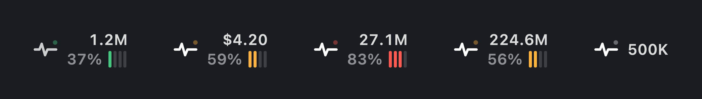
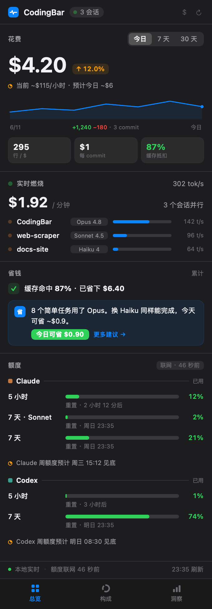

<h4 align="right"><a href="README.md">English</a> | <strong>简体中文</strong></h4>

<div align="center">
  <h1>CodingBar</h1>
  <p><b>常驻 macOS 菜单栏的 AI 编程副驾驶仪表盘。</b></p>
  <a href="https://github.com/Gnonymous/CodingBar/actions/workflows/ci.yml"></a>
  <a href="https://github.com/Gnonymous/CodingBar/stargazers"></a>
  <a href="https://github.com/Gnonymous/CodingBar/releases"></a>
  <a href="LICENSE"></a>
  
  
</div>

<p align="center">
  
</p>

<p align="center">
  
</p>

<p align="center"><sub><em>截图由 <code>--render-panel</code> 基于样本数据渲染。</em></sub></p>

<details>
<summary><strong>更多视图 — 构成 · 洞察 · 浅色模式</strong></summary>
<br/>
<table>
  <tr>
    <td></td>
    <td></td>
    <td></td>
  </tr>
</table>
</details>

## 为什么

Tokei / CodexBar 是**账单**——你花了多少钱。CodingBar 想做**副驾驶仪表盘**：你和 AI 一起干成了什么、值不值、怎么更值。token / 成本 / 额度退居底座，洞察上位。

所有数据都从本地 **Claude Code** 与 **Codex** 日志读取——增量扫描、无外部依赖、无 Xcode。**只有额度查询联网**，且仅用你自己的 token 发只读请求。

## 特性

- **成果优先于花费**：把 git 产出（+/− 行 · commit · 文件）与今日花费并置，附 `$/行`、`$/commit`。让花费第一次能被读成*干成的活*。
- **实时教练**：当前会话上下文燃料表（含 1M-context 识别）、额度燃尽线性预测，以及省钱提示——如*「8 个简单任务用了 Opus，换 Haiku 可省 $0.9」*。
- **行为镜子**：工具使用占比（写 / 读 / 跑 / 搜）、协作节奏、黄金时段活跃热力图——全部来自日志里的 `tool_use` 事件。
- **活着的菜单栏**：单色脉冲随实时吞吐跳动，配两行严格等宽数字——今日 token / 花费与剩余额度一目了然。
- **本地优先、隐私至上**：用量、成本、行为、git 全部 100% 离线。额度是唯一的联网调用——只读查*你自己*的用量，不上传任何内容，读凭证时绝不弹密码框。
- **原生、零依赖**：纯 SwiftPM，无 Xcode 工程，无第三方包。直接增量读取 `~/.claude/projects` 与 `~/.codex/sessions`。

## 安装

### 下载

从 [Releases](https://github.com/Gnonymous/CodingBar/releases) 下载最新的 `.dmg`（或 `.zip`），打开后把 **CodingBar** 拖进「应用程序」。

应用是 **ad-hoc 签名**（无付费 Apple Developer ID），首次启动 Gatekeeper 会拦。右键 → **打开**，或清掉隔离标记：

```bash
xattr -dr com.apple.quarantine /Applications/CodingBar.app
```

脉冲图标会出现在菜单栏右侧。

### 从源码构建

需要 macOS 14+ 与 Swift 6 工具链（Command Line Tools 即可，无需 Xcode）。

```bash
make run        # 调试运行（菜单栏出现脉冲图标）
make dump       # 打印计算出的 Snapshot JSON（验证数据层，不开 GUI）
make test       # 可运行自检
make package    # 产出 dist/CodingBar.app
```

## 面板

点开菜单栏项目，是一个三 Tab 面板：

- **总览**（Overview）— 「成果 ↔ 代价」英雄区（git 产出 ‖ 今日花费）、`$/行` 与 `$/commit`、实时教练（上下文燃料 + 省钱提示）、实时额度进度条与燃尽预测、近 7 天趋势。
- **构成**（Composition）— 钱花在哪：按模型与按项目的花费拆解。
- **洞察**（Insights）— 代码产出、工具使用占比、黄金时段热力图，以及省钱提示与额度燃尽预测。

设计真源见 `mockups/`（`menubar-numbers-v4.html`、`panel-02.html`）。

## 隐私

- **用量 / 成本 / 行为 / git** — 100% 本地、离线。只读取 `~/.claude/projects/**/*.jsonl` 与 `~/.codex/sessions/**/*.jsonl`。价格表（`Sources/CodingBar/Resources/pricing.json`）用户可改。
- **额度** — 唯一联网的部分。带你自己的 OAuth token 向各家用量接口发**只读 GET**（Claude `api.anthropic.com/api/oauth/usage`、Codex `chatgpt.com/backend-api/wham/usage`）。不上传任何本地内容、不查消费明细。5 分钟 TTL 缓存。
- **防弹窗凭证** — Claude 的 OAuth token 存在 Keychain。自签名进程直接读会被 macOS 反复弹密码框，因此 CodingBar spawn Apple 签名的 `/usr/bin/security`（在该条目可信 ACL 内）静默读取，读不到就降级为*「额度不可用」*。**绝不弹密码框。** Codex 走 `~/.codex/auth.json`。

## 架构

纯 SwiftPM，两个 target，数据层与 UI 完全解耦：

- **`CodingBarCore`** — 无 UI、可测的数据层：`Scanner`（增量缓存）、`ClaudeScanner` / `CodexScanner`、`Pricing`、`Aggregator`，四支柱（`Behavior` / `Fuel` / `Forecast` / `Coach` / `GitCorrelator`），以及 `Quota/`（`Credentials`、Claude/Codex fetcher、5min TTL 缓存的 `QuotaService`）。产出一个不可变 `Snapshot`。
- **`CodingBar`** — AppKit `NSStatusItem` + SwiftUI 应用：`UsageStore`（`@MainActor ObservableObject`）、`RefreshLoop`、`StatusItemController`、`MenuBarItemView`，以及三 Tab 面板。

因为分层解耦，`swift run CodingBar --dump-json` 可不开 GUI 用真实日志验证数据，`--render-menubar` / `--render-panel` 能把 UI 离屏渲染成 PNG。完整地图见 [`CLAUDE.md`](CLAUDE.md)。

## 路线

v1 已实现上述全部。后续：

- 打通范围切换器（总览为「今日」；模型 / 项目 / 缓存为「全部」，已如实标注）。
- 设计正式 app 图标（菜单栏目前用占位脉冲 glyph）。
- 自动更新（Sparkle）与公证构建。

## 贡献

欢迎 Issue 与 PR。先读 [`CLAUDE.md`](CLAUDE.md)：它记录了架构、`Models.swift` 冻结契约、注释哲学，以及凭证 / 隐私相关的「地雷」。CI 会在每次 push 保持 `swift build` 与 `swift test` 通过。

## License

[Apache License 2.0](LICENSE)。如果你把 CodingBar fork 成自己的产品，请改用不同的名字并署名来源 CodingBar。参考项目（KeyStats / Tokei / CodexBar）仅作本地研究，不随仓库分发。
